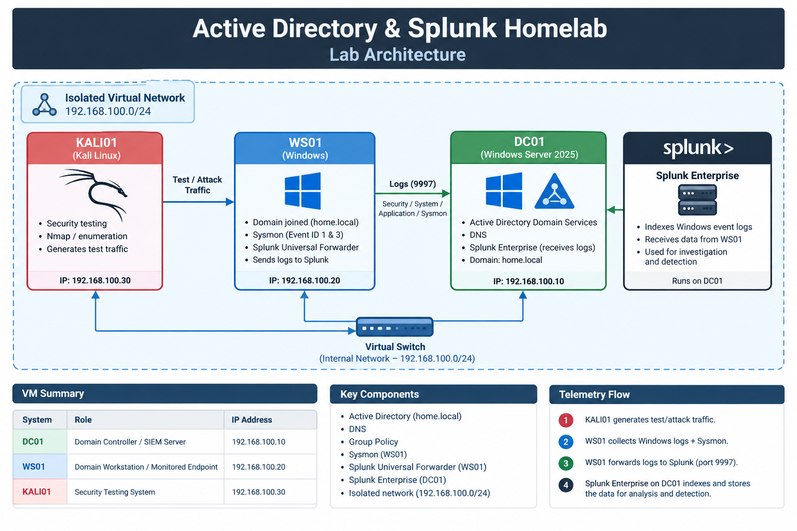

# Active Directory & Splunk SOC Homelab

## Overview

This project documents the development of my virtual cybersecurity homelab used to practice SOC monitoring, security investigation, and detection engineering.

The environment was built in Oracle VirtualBox and includes a Windows Server domain controller, a domain-joined Windows workstation, and a Kali Linux system used to generate controlled security activity. Splunk Enterprise provides centralized log collection and analysis, with Windows event logs and Sysmon telemetry forwarded from the workstation.

I use this environment to simulate security events, investigate endpoint and network telemetry, develop SPL detections, and validate alerting workflows.

## Lab Architecture

## Lab Environment

| System | Role | Configuration |
|---|---|---|
| **DC01** | Domain Controller / SIEM Server | Windows Server 2025, Active Directory Domain Services, DNS, Splunk Enterprise |
| **WS01** | Domain Workstation / Monitored Endpoint | Windows, Splunk Universal Forwarder, Sysmon |
| **KALI01** | Security Testing System | Kali Linux, Nmap and other security testing tools |

### Network

The lab operates on an isolated virtual network using the `192.168.100.0/24` private address space.

- **DC01:** `192.168.100.10`
- **WS01:** `192.168.100.20`
- **KALI01:** `192.168.100.30`
- **Domain:** `home.local`

 ## Security Monitoring

WS01 is configured as the primary monitored endpoint in the lab. Windows security telemetry and Sysmon events are collected from the workstation and forwarded to Splunk Enterprise running on DC01.

The Splunk Universal Forwarder on WS01 sends log data to DC01 over TCP port 9997.

### Monitored Data Sources

- Windows Security Event Log
- Windows System Event Log
- Windows Application Event Log
- Sysmon Operational Log
- Windows Firewall telemetry

This telemetry provides visibility into authentication activity, process creation, network connections, and other endpoint events used for security investigations and detection development.
